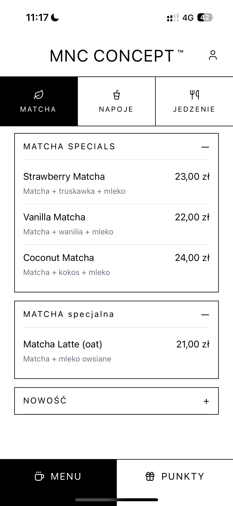
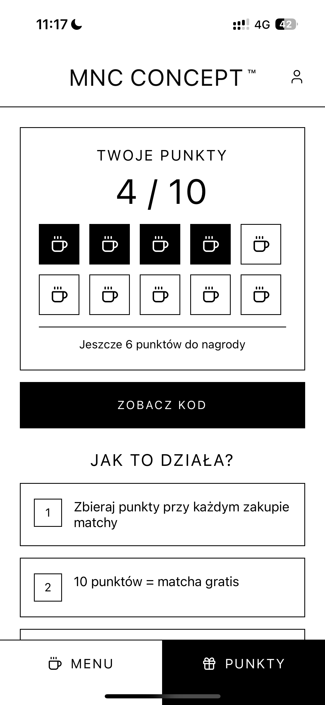
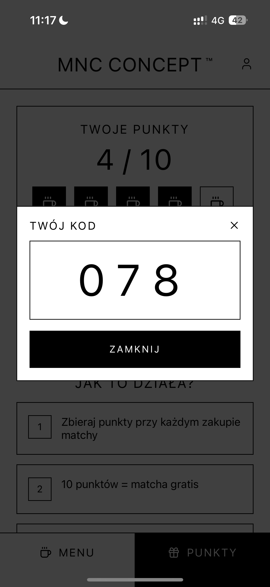
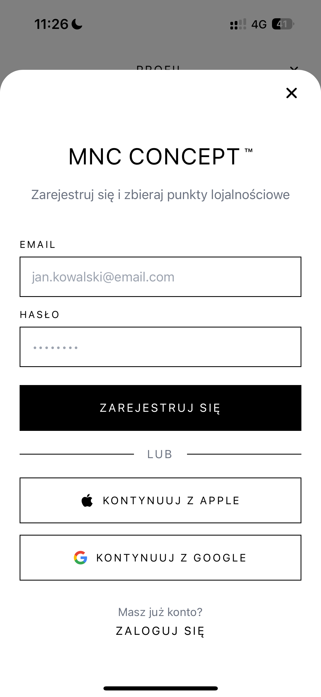
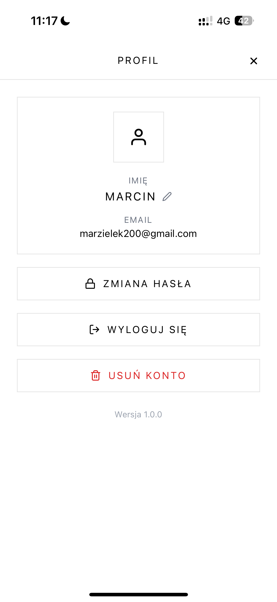

# MNC Concept - iOS Mobile Application

A custom-built loyalty and menu management solution developed for the MNC Concept cafe in Poland. The application is currently deployed and undergoing beta testing via Apple TestFlight.

## Core Functionality

* **Real-time Menu Synchronization:** Dynamic menu updates powered by Supabase Real-time. Any changes made in the Admin Dashboard are reflected instantly for mobile users.
* **Loyalty & Rewards System:** Users accumulate points for purchases which can be exchanged for rewards. Each profile generates a unique identifier for staff verification and point processing.
* **Push Notification Engine:** Integrated system for real-time and scheduled promotional notifications, allowing direct engagement with the user base.
* **User Accounts:** Secure authentication and profile management for tracking individual point balances and history.

## Technical Architecture

* **Frontend:** Built with React Native (TypeScript) and Expo for a high-performance, cross-platform experience.
* **Backend & Database:** Utilizes Supabase (PostgreSQL) for data persistence and real-time event handling.
* **Serverless Logic:** Implementation of Supabase Edge Functions for secure handling of loyalty point transactions and notification scheduling.

## Tech Stack

* React Native (TypeScript)
* Expo
* Supabase (PostgreSQL, Real-time, Auth, Edge Functions)
* iOS (TestFlight Deployment)

## Previews

<table width="100%">
  <tr>
    <td align="center" valign="top" width="33%">
       
      <b>Menu View</b>
    </td>
    <td align="center" valign="top" width="33%">
       
      <b>Rewards Shop</b>
    </td>
    <td align="center" valign="top" width="33%">
       
      <b>Loyalty Code</b>
    </td>
  </tr>
  <tr>
    <td align="center" valign="top" width="33%">
       
      <b>Login Screen</b>
    </td>
    <td align="center" valign="top" width="33%">
       
      <b>User Profile</b>
    </td>
    <td align="center" valign="top" width="33%">
      </td>
  </tr>
</table>

---
*Note: This repository covers the mobile client. The management interface is located in the [mnc-admin] repository.*